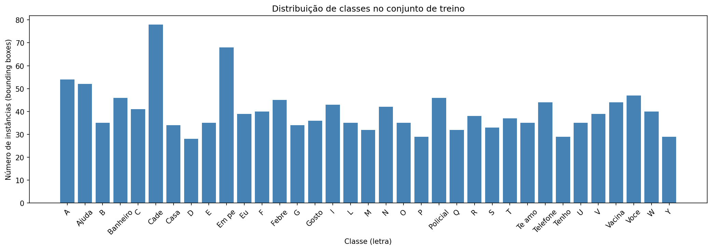
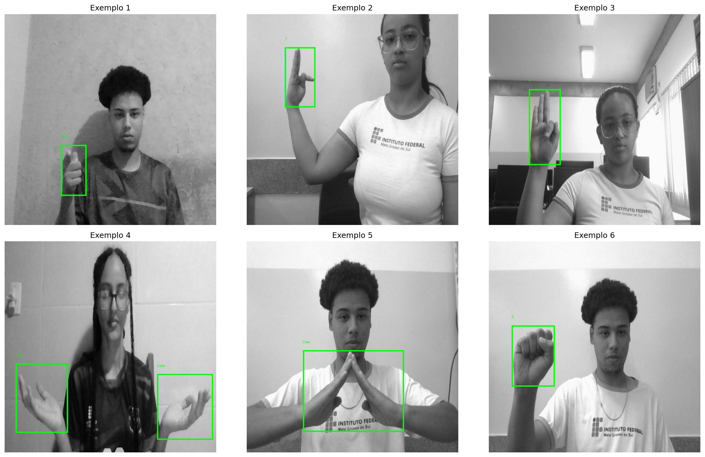

# Detecção de LIBRAS com YOLO

Projeto final da disciplina de **Ciência de Dados** — treinamento de um modelo YOLO para detecção de **sinais do alfabeto e de um vocabulário de emergência/saúde da Língua Brasileira de Sinais (LIBRAS)**.

> **Classe inédita (fora do COCO):** as 80 classes padrão do YOLO/COCO não incluem gestos manuais de LIBRAS. Nenhuma das 35 classes deste projeto existe no COCO, atendendo ao requisito de classe inédita.

---

## 👥 Integrantes - Grupo A

- Diego Benevides Fontenele
- Eduardo Jorge Andrade Mourão Oliveira
- Ian Sampaio Lira Waki
- João Arthur Veras Barros Dias

## 🎯 Objetivo

Treinar um modelo YOLO para detectar e classificar sinais de LIBRAS em imagens reais, com foco em uma possível aplicação em ferramentas de acessibilidade e comunicação em contextos de emergência e saúde.

## 📦 Dataset

- **Fonte:** [Projeto LIBRAS — Roboflow Universe](https://universe.roboflow.com/gomes-project/projeto-libras) (versão 20)
- **Licença:** CC BY 4.0
- **Formato:** YOLOv8 Detection (imagens + labels com bounding boxes)
- **Total de instâncias anotadas:** 1.409
- **Imagens:** 1.374 (treino) + 469 (validação) + teste (já dividido pelo Roboflow)
- **Número de classes:** 35
- **Classes:** `A, Ajuda, B, Banheiro, C, Cade, Casa, D, E, Em pe, Eu, F, Febre, G, Gosto, I, L, M, N, O, P, Policial, Q, R, S, T, Te amo, Telefone, Tenho, U, V, Vacina, Voce, W, Y`

> O conjunto mistura **letras do alfabeto manual** (A, B, C, D, ...) com **palavras e frases completas** de uso prático (Ajuda, Banheiro, Febre, Policial, Vacina, Te amo, ...), formando um pequeno vocabulário voltado a situações de emergência e atendimento.

### Estrutura após download (no Colab)

```
<DATASET_PATH>/
├── train/
│   ├── images/   (*.jpg)
│   └── labels/   (*.txt — formato YOLO)
├── valid/
│   ├── images/
│   └── labels/
├── test/
│   ├── images/
│   └── labels/
└── data.yaml      (gerado pelo Roboflow)
```

## 🏗️ Estrutura do repositório

```
av3_cdd_yolo/
├── README.md                    # Este arquivo
├── YOLO_LIBRAS.ipynb            # Notebook de TREINO/AVALIAÇÃO (rodar no Colab com GPU)
├── YOLO_LIBRAS_webcam.ipynb     # Notebook de TESTE EM TEMPO REAL (rodar localmente)
├── models/
│   └── README.md                # Onde colocar o best.pt (modelo treinado, fora do Git)
├── real_world_test/
│   ├── README.md
│   └── images/                  # Snapshots reais capturados pela equipe (webcam)
├── results/                     # Métricas, gráficos, matriz de confusão e predições
├── report/
│   └── relatorio_template.md    # Relatório técnico (base para o PDF)
└── .gitignore
```

## ▶️ Como executar

O projeto tem **dois notebooks** com papéis diferentes:

### 1. Treino e avaliação — `YOLO_LIBRAS.ipynb` (Google Colab, com GPU)

1. Crie uma conta no [Roboflow](https://roboflow.com) e pegue sua API key em https://app.roboflow.com/settings/api.
2. Abra `YOLO_LIBRAS.ipynb` no **Google Colab** com runtime de **GPU** (Runtime → Change runtime type → T4 GPU).
3. Cole sua API key na célula de download do dataset (variável `ROBOFLOW_API_KEY`) e confirme `VERSION_NUMBER = 20`.
4. Execute as células **em ordem, do início ao fim** (Runtime → Run all):
   - 📦 Instalação de dependências
   - 📥 Download do dataset via Roboflow API
   - 🔍 Exploração (distribuição de classes + visualização de bboxes)
   - 🏋️ Treinamento do YOLOv8m
   - 📊 Avaliação (mAP, precisão, recall, matriz de confusão)
   - 🤳 Inferência nas imagens do conjunto de teste e nas fotos da equipe
5. A última célula gera `artefatos_libras.zip`. Baixe-o e descompacte o conteúdo em `results/`.
6. Coloque o `best.pt` (de `runs/detect/libras_yolov8m/weights/`) em `models/best.pt`.

> ⚠️ O notebook precisa ser baixado do Colab **já executado** (com as saídas/gráficos salvos), pois o requisito do projeto é entregar o `.ipynb` com todo o código executado.

### 2. Teste em tempo real — `YOLO_LIBRAS_webcam.ipynb` (local)

1. Tenha o `best.pt` em `models/best.pt`.
2. Rode localmente (o Colab não acessa a webcam do seu computador).
3. Controles na janela da webcam:

| Tecla | Ação |
|---|---|
| `Q` | Sair |
| `S` | Salvar snapshot anotado em `real_world_test/images/` |
| `+` / `-` | Aumentar / diminuir o threshold de confiança |

## 📊 Resultados

### Métricas globais (conjunto de teste)

| Métrica | Valor |
|---|---|
| mAP@0.5 | 0,987 |
| mAP@0.5:0.95 | 0,826 |
| Precisão | 0,966 |
| Recall | 0,978 |

> Resultado obtido no conjunto de teste (195 imagens). Treino de 50 épocas do
> YOLOv8m, concluído no Google Colab com GPU.

### Seção visual — predições e gráficos

> As imagens abaixo demonstram visualmente o funcionamento do modelo, conforme
> exigido no enunciado ("seção visual demonstrando os resultados das predições").
> Todas já estão presentes no repositório (geradas no treino + capturadas pela equipe).

**1. Distribuição de classes no dataset**



**2. Amostras do conjunto de teste (com caixas verdadeiras)**



**3. Curvas de treinamento (loss, precisão, recall, mAP por época)**


**4. Matriz de confusão normalizada (conjunto de teste)**


**5. Predições nas imagens reais e do conjunto de teste**


**6. Batch de treino com data augmentation aplicada**


**7. Sistema rodando em tempo real (webcam) — material capturado pela equipe**

> Snapshots reais capturados durante o teste com a webcam (`YOLO_LIBRAS_webcam.ipynb`),
> com o sistema detectando ao vivo três letras do alfabeto LIBRAS.

| L (conf. 0,50) | E (conf. 0,74) | A (conf. 0,57) |
|---|---|---|
|  |  |  |

> As capturas mostram o overlay do sistema (FPS, threshold, nº de detecções) e a
> bounding box com o label desenhados em tempo real.

## 📄 Relatório técnico

O relatório técnico completo está em [`report/relatorio_template.md`](report/relatorio_template.md),
que serve de base para o PDF entregue via AVA. O link público deste repositório
consta em destaque no topo do relatório (requisito obrigatório do projeto).

## 🛠️ Stack

- Python 3 + [Ultralytics YOLO](https://docs.ultralytics.com/) (YOLOv8m, detection)
- PyTorch + CUDA
- OpenCV (webcam / inferência em tempo real)
- Roboflow (download do dataset)
- Google Colab (treinamento em nuvem com GPU)
