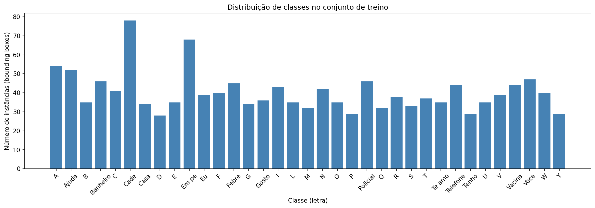
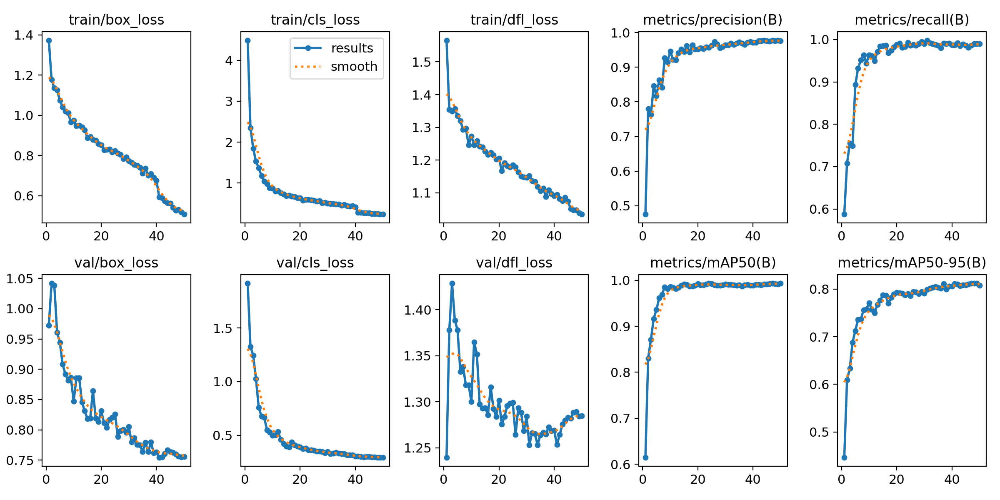
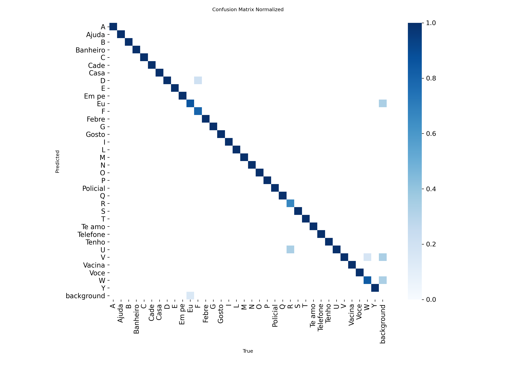
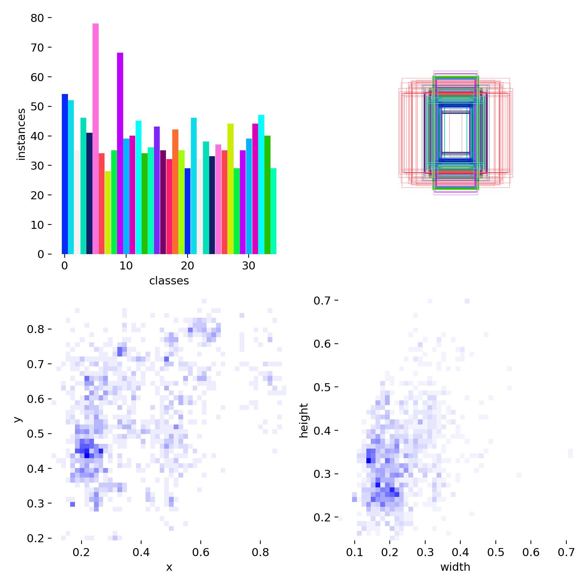
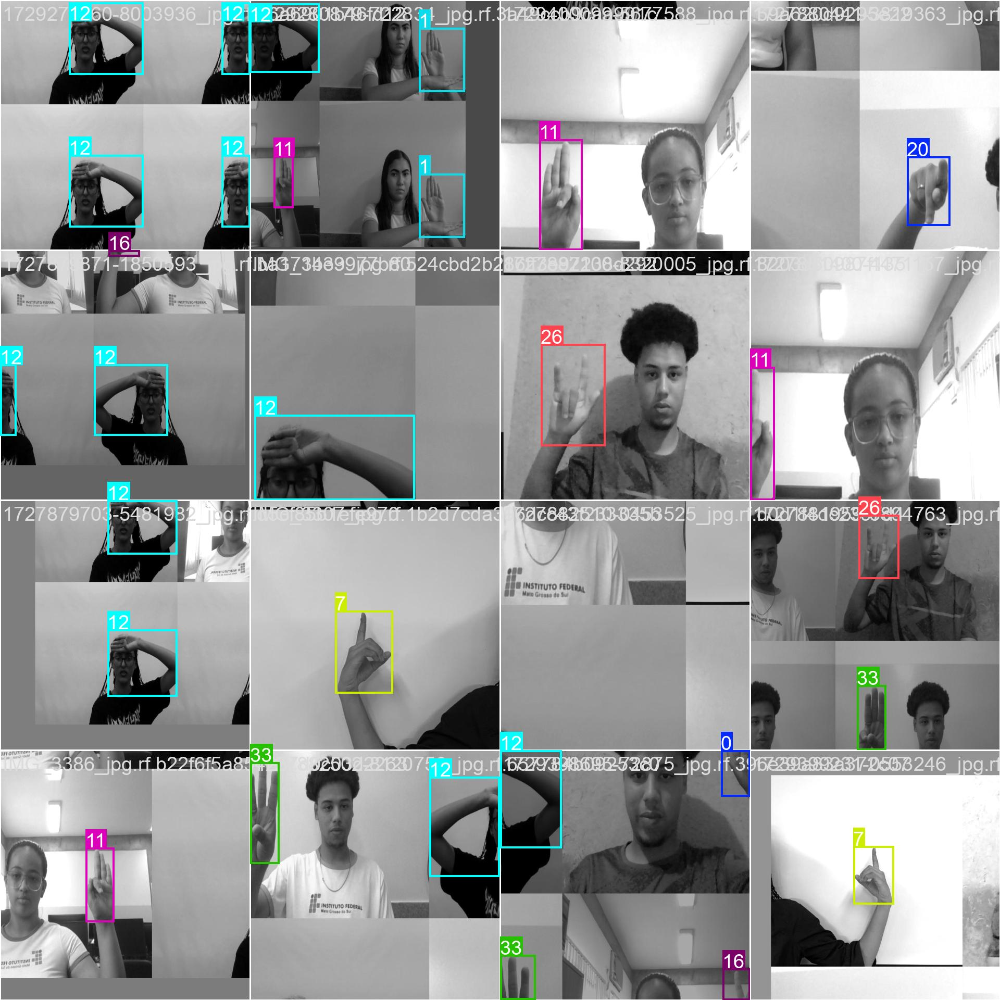
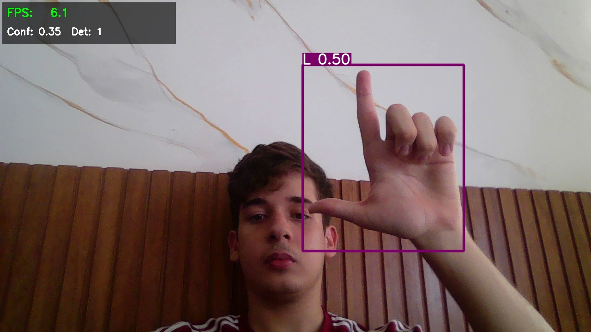
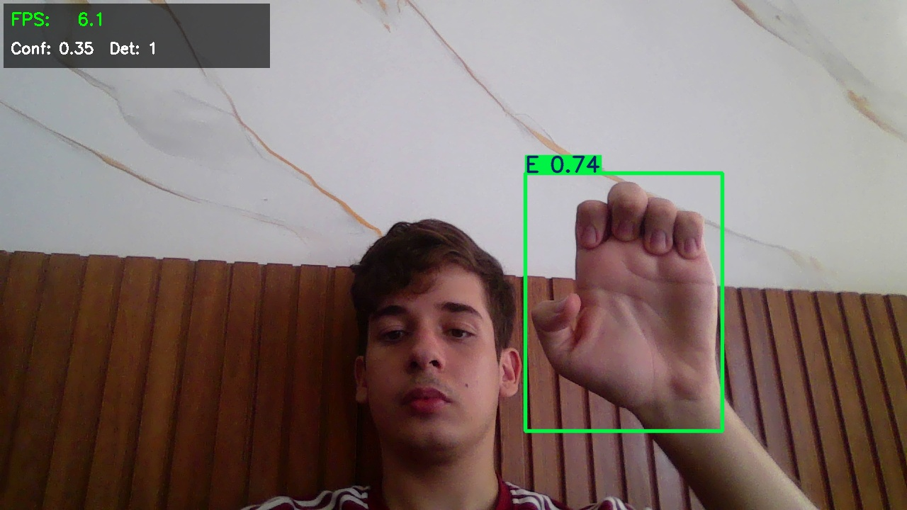
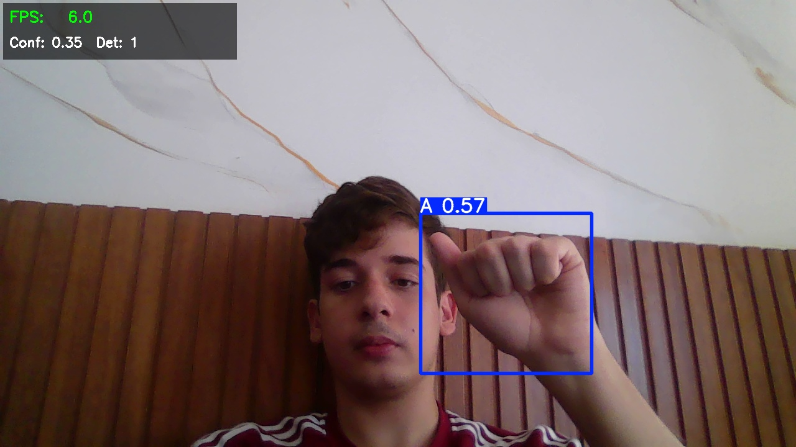
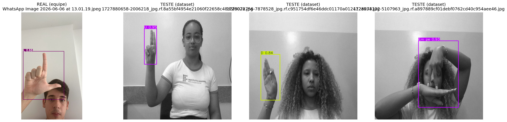
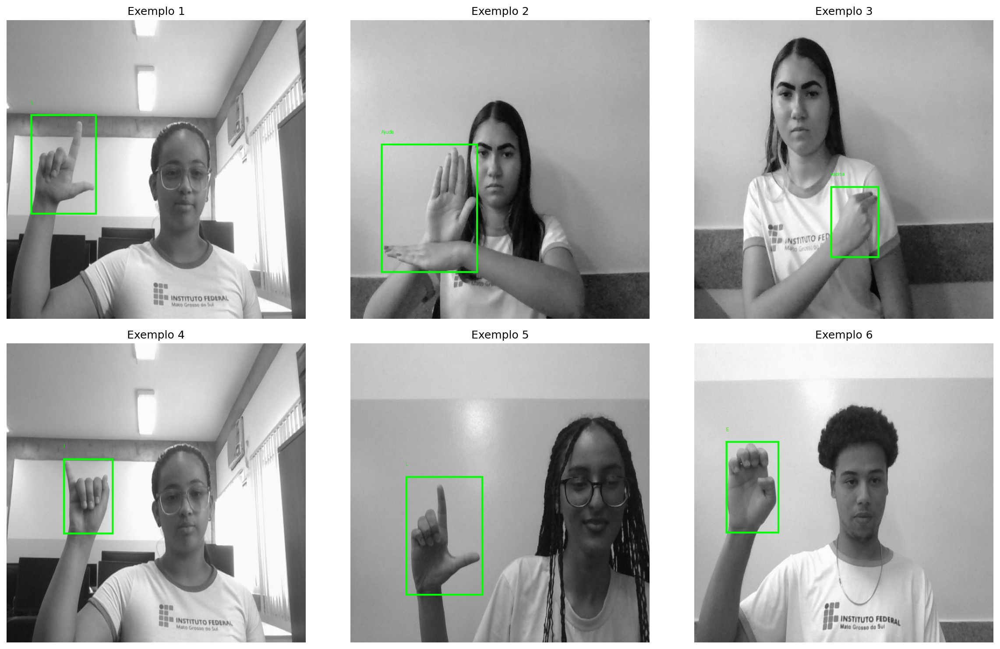

# Relatório Técnico Projeto 3 — Detecção de LIBRAS com YOLO

## 1. Identificação

- **Título:** Detecção de sinais de LIBRAS com YOLO
- **Disciplina:** T326-36/37 Ciência dos dados
- **Professor:** Túlio Rodrigues Ribeiro
- **Integrantes - Grupo A:**
  - Diego Benevides Fontenele (2310381)
  - Eduardo Jorge Andrade Mourão Oliveira (2310384)
  - Ian Sampaio Lira Waki (2310398)
  - João Arthur Veras Barros Dias (2315431)
- **Repositório GitHub:** **https://github.com/Wakian/av3_cdd_yolo**

---

## 2. Introdução e Motivação

A **Língua Brasileira de Sinais (LIBRAS)** é a língua oficial da comunidade surda no Brasil, reconhecida pela Lei nº 10.436/2002. Apesar do reconhecimento legal, ainda existe uma barreira significativa de comunicação entre surdos e ouvintes, especialmente em contextos críticos como atendimento de emergência e saúde. Ferramentas automáticas de tradução visual contribuem diretamente para a acessibilidade nessas situações.

Este projeto utiliza o modelo **YOLO (You Only Look Once)** para detectar sinais de LIBRAS em imagens. O conjunto de classes escolhido vai além do alfabeto manual: além de letras (A, B, C, D, ...), inclui **palavras e frases de uso prático em emergências e saúde** (Ajuda, Banheiro, Febre, Policial, Vacina, Telefone, Te amo, entre outras). Essa escolha torna a tarefa mais próxima de uma aplicação real de comunicação assistiva.

### Justificativa da classe inédita

Nenhuma das **35 classes** deste projeto está presente nas 80 categorias do dataset **COCO**, no qual o YOLO é pré-treinado. A categoria mais próxima no COCO seria "person", que não cobre nem a região anatômica (a mão) nem a semântica (a configuração específica de cada sinal). Portanto, a tarefa atende plenamente ao requisito de **classe inteiramente inédita** do projeto.

---

## 3. Metodologia

### 3.1 Dataset

| Atributo | Valor |
|---|---|
| Fonte | [Projeto LIBRAS — Roboflow](https://universe.roboflow.com/gomes-project/projeto-libras/dataset/20) |
| Versão | 20 |
| Licença | CC BY 4.0 |
| Formato | YOLOv8 Detection (imagens + bounding boxes) |
| Total de instâncias anotadas | 1.409 |
| Imagens de treino | 1.374 |
| Imagens de validação | 469 |
| Imagens de teste | 195 |
| Número de classes | 35 |
| Pré-processamento (Roboflow) | auto-orient + resize 640×640 |
| Data augmentation | aplicada pelo Ultralytics no treino (HSV, flip horizontal, mosaic) |

**Classes (35):** A, Ajuda, B, Banheiro, C, Cade, Casa, D, E, Em pe, Eu, F, Febre, G, Gosto, I, L, M, N, O, P, Policial, Q, R, S, T, Te amo, Telefone, Tenho, U, V, Vacina, Voce, W, Y.

#### Distribuição de classes

Dados reais extraídos da exploração do dataset:
- Classe com **mais** exemplos: **Cade (78 instâncias)**
- Classe com **menos** exemplos: **D (28 instâncias)**
- Razão de desbalanceamento (max/min): **2,79×**

Há um desbalanceamento moderado (≈2,8×) entre as classes. Classes com menos exemplos (como o **D**, com 28 instâncias) tendem a apresentar precisão/recall mais baixos por terem menos amostras para o modelo aprender — efeito que de fato aparece na análise por classe (seção 4.4), onde o D foi a letra de menor precisão. Ainda assim, o desbalanceamento não é severo o suficiente para comprometer o desempenho geral.

### 3.2 Ferramentas e ambiente

- **Linguagem:** Python 3
- **Biblioteca principal:** Ultralytics YOLO v8.x
- **Framework:** PyTorch com CUDA
- **Ambiente de treino:** Google Colab — GPU (treinamento em nuvem, conforme exigido pelo projeto)
- **Teste em tempo real:** máquina local com webcam + GPU NVIDIA (OpenCV)
- **Versionamento:** GitHub
- **Gerenciamento de dataset:** Roboflow

### 3.3 Configuração de treinamento

Valores reais conforme registrados no log de treino do notebook (`engine/trainer`):

| Hiperparâmetro | Valor | Observação |
|---|---|---|
| Arquitetura | YOLOv8m (`yolov8m.pt`) | 25,9 M de parâmetros; equilíbrio acurácia × custo |
| Pré-treinado em | COCO | Transfer learning (469/475 camadas transferidas) |
| Épocas | 50 | com early stopping |
| Patience (early stop) | 15 | interrompe se não houver melhora |
| Batch size | 16 | — |
| Image size | 640 × 640 | padrão YOLO |
| Otimizador | AdamW (selecionado por `optimizer=auto`) | lr0 ≈ 0,000256, momentum = 0,9 |
| Data augmentation | HSV (h=0.015, s=0.7, v=0.4), flip horizontal (0.5), mosaic (1.0) | defaults do Ultralytics |
| Seed | 0 | reprodutibilidade |

> Observação técnica: o dataset gerou um aviso de "box vs segment" no Ultralytics (algumas imagens com segmentos), resolvido automaticamente usando apenas as bounding boxes — comportamento esperado para tarefa de *detection*.

---

## 4. Análise de Resultados

### 4.1 Métricas globais no conjunto de teste

| Métrica | Valor |
|---|---|
| Precisão média | 0,966 |
| Revocação (Recall) média | 0,978 |
| mAP@0.5 | 0,987 |
| mAP@0.5:0.95 | 0,826 |

**Interpretação:** O modelo atingiu desempenho muito alto no conjunto de teste (195 imagens, 202 instâncias). O **mAP@0.5 de 0,987** indica que, com o critério de sobreposição tolerante (IoU ≥ 0.5), o modelo acerta praticamente todos os sinais — a maioria das 35 classes atingiu mAP@0.5 = 0,995. A combinação de **precisão 0,966** e **recall 0,978** mostra um modelo equilibrado, que erra pouco tanto por falso positivo quanto por deixar de detectar.

A diferença para o **mAP@0.5:0.95 de 0,826** (métrica mais rigorosa, que exige caixas bem posicionadas em vários níveis de IoU) revela que, embora a *classificação* do sinal seja quase sempre correta, o *posicionamento exato* da bounding box ainda tem margem de melhora em algumas classes. Isso é esperado em datasets com mãos, onde os limites da caixa são menos nítidos que objetos rígidos.

> Observação metodológica: o conjunto de teste é pequeno (195 imagens, ~5–12 por classe). Métricas tão altas devem ser lidas com isso em mente — o resultado é excelente, mas um teste maior daria uma estimativa mais robusta da generalização.

### 4.2 Curvas de treinamento

O treino rodou as **50 épocas completas** (o early stopping com `patience=15` não foi
acionado). Na época final (50), os valores de validação foram: precisão ≈ 0,976,
recall ≈ 0,990, mAP@0.5 ≈ 0,993 e mAP@0.5:0.95 ≈ 0,808 — coerentes com o resultado
no conjunto de teste, o que sugere **ausência de overfitting severo**.

Observações a partir do gráfico:
- A queda dos losses (box / cls / dfl) ao longo das épocas foi estável, sem oscilações bruscas.
- As curvas de mAP de validação subiram rapidamente nas primeiras épocas e se estabilizaram em patamar alto.
- Como as curvas de treino e validação ficaram próximas até o fim, não há sinal forte de overfitting.

### 4.3 Matriz de confusão

*Matriz de confusão normalizada no conjunto de teste. A versão da validação está em
`results/confusion_matrix_normalized.png`.*

**Análise crítica (com base nos resultados reais):** a grande maioria dos sinais foi
classificada corretamente — a diagonal principal concentra quase toda a massa, coerente
com o mAP@0.5 de 0,987. As classes que mais "escaparam" do acerto perfeito (recall < 1,0) foram:
- **Eu** — recall 0,857 (a classe mais difícil: também teve o menor mAP@0.5:0.95, 0,493).
- **R** — recall 0,667.
- **Cade** — recall 0,920.
- **W** — recall 0,946.
- **F** — recall 0,841.

Confusões esperadas em LIBRAS, por semelhança de configuração de mão, que valem observar na matriz:
- **R × U** (cruzamento de dedos) — U teve precisão 0,950, levemente menor que as demais letras.
- **U × V** (mesma configuração, abertura diferente) — V teve a menor precisão entre as letras (0,870).
- **A × S** (mão fechada similar) — relevante porque, no teste prático com a webcam (seção 5.1), o "A" foi reconhecido com confiança moderada, justamente por essa ambiguidade.

### 4.4 Métricas por classe

Tabela completa (extraída de `results/metricas_por_classe.csv`):

| Classe | Precisão | Recall | mAP@0.5 | mAP@0.5:0.95 |
|---|---|---|---|---|
| A | 0,986 | 1,000 | 0,995 | 0,784 |
| Ajuda | 0,986 | 1,000 | 0,995 | 0,871 |
| B | 0,973 | 1,000 | 0,995 | 0,896 |
| Banheiro | 0,989 | 1,000 | 0,995 | 0,564 |
| C | 0,980 | 1,000 | 0,995 | 0,866 |
| Cade | 1,000 | 0,920 | 0,995 | 0,641 |
| Casa | 0,978 | 1,000 | 0,995 | 0,899 |
| D | 0,743 | 1,000 | 0,995 | 0,951 |
| E | 0,970 | 1,000 | 0,995 | 0,915 |
| Em pe | 0,990 | 1,000 | 0,995 | 0,778 |
| Eu | 0,848 | 0,857 | 0,794 | 0,493 |
| F | 1,000 | 0,841 | 0,995 | 0,975 |
| Febre | 0,981 | 1,000 | 0,995 | 0,786 |
| G | 0,969 | 1,000 | 0,995 | 0,895 |
| Gosto | 1,000 | 1,000 | 0,995 | 0,804 |
| I | 0,981 | 1,000 | 0,995 | 0,813 |
| L | 0,972 | 1,000 | 0,995 | 0,876 |
| M | 0,968 | 1,000 | 0,995 | 0,920 |
| N | 0,977 | 1,000 | 0,995 | 0,887 |
| O | 0,978 | 1,000 | 0,995 | 0,819 |
| P | 0,960 | 1,000 | 0,995 | 0,995 |
| Policial | 1,000 | 1,000 | 0,995 | 0,632 |
| Q | 0,975 | 1,000 | 0,995 | 0,866 |
| R | 0,935 | 0,667 | 0,913 | 0,838 |
| S | 0,972 | 1,000 | 0,995 | 0,855 |
| T | 0,973 | 1,000 | 0,995 | 0,963 |
| Te amo | 0,979 | 1,000 | 0,995 | 0,725 |
| Telefone | 0,993 | 1,000 | 0,995 | 0,529 |
| Tenho | 0,986 | 1,000 | 0,995 | 0,796 |
| U | 0,950 | 1,000 | 0,995 | 0,975 |
| V | 0,870 | 1,000 | 0,995 | 0,939 |
| Vacina | 0,986 | 1,000 | 0,995 | 0,774 |
| Voce | 0,987 | 1,000 | 0,995 | 0,725 |
| W | 1,000 | 0,946 | 0,995 | 0,923 |
| Y | 0,969 | 1,000 | 0,995 | 0,935 |

**Melhores classes** (precisão e recall = 1,0): Gosto, Policial — além de várias
letras com mAP@0.5:0.95 alto, como P (0,995), F (0,975), U (0,975), T (0,963).

**Classes mais difíceis:**

| Classe | Precisão | Recall | mAP@0.5:0.95 | Provável causa |
|---|---|---|---|---|
| Eu | 0,848 | 0,857 | 0,493 | menor desempenho geral; sinal com movimento/apontar |
| R | 0,935 | 0,667 | 0,838 | confusão com U (cruzamento de dedos) |
| Telefone | 0,993 | 1,0 | 0,529 | bbox mal posicionada (localização) |
| Banheiro | 0,989 | 1,0 | 0,564 | localização imprecisa |
| Policial | 1,0 | 1,0 | 0,632 | localização imprecisa apesar de classificar bem |
| D | 0,743 | 1,0 | 0,951 | menor precisão; D tem poucos exemplos (28 no dataset) |

Pontos de análise:
- **Nº de exemplos:** o **D** é a classe com menos amostras (28) e teve a menor precisão entre as letras (0,743) — coerente com o desbalanceamento apontado na seção 3.1.
- **Movimento:** sinais que envolvem trajetória (como **Eu**) sofrem mais quando capturados em imagem estática, o que explica seu desempenho ser o pior do conjunto.
- **Localização vs. classificação:** classes como **Telefone**, **Banheiro** e **Policial** classificam perfeitamente (mAP@0.5 = 0,995) mas têm mAP@0.5:0.95 baixo — ou seja, o modelo *reconhece* o sinal, mas a *precisão da caixa* é o ponto fraco nesses casos.

Para referência visual da distribuição das anotações e da composição dos lotes de treino:

*Distribuição espacial e de tamanho das bounding boxes no dataset.*

*Exemplo de um lote de treino com as augmentations do Ultralytics aplicadas (mosaic, flip, variação de HSV).*

### 4.5 Curvas PR e F1

As curvas individuais de Precisão×Revocação (PR) e F1×Confiança por classe são geradas
pelo Ultralytics, mas **não foram incluídas no conjunto de artefatos exportado** deste
treino. As informações equivalentes, porém, já estão cobertas pelos dados das seções
anteriores: o **mAP@0.5 = 0,987** resume a área sob a curva PR (com IoU 0.5), e as
métricas de precisão (0,966) e recall (0,978) por classe constam na tabela da seção 4.4.

Dado o desempenho elevado e equilibrado entre precisão e recall, um threshold de
confiança na faixa de **0,3–0,5** tende a maximizar o F1 em uso real — faixa coerente
com o `CONF_THRESHOLD = 0,35` adotado no teste em tempo real (seção 5.1). Caso seja
necessário gerar as curvas, basta reexecutar a validação do modelo com `plots=True`.

---

## 5. Inferência Prática

### 5.1 O sistema em execução (teste em tempo real com webcam)

O sistema foi testado **ao vivo**, com o modelo treinado (`best.pt`) aplicado sobre
a imagem da webcam em tempo real, por meio do notebook `YOLO_LIBRAS_webcam.ipynb`
rodado localmente. As capturas abaixo foram **produzidas pela própria equipe** e
mostram o sistema detectando três letras diferentes do alfabeto manual, com a
bounding box, o label e a confiança desenhados em tempo real (overlay com FPS e
threshold visível no canto).

| Captura | Sinal | Confiança | Arquivo |
|---|---|---|---|
| 1 | **L** | 0,50 | `real_world_test/images/snapshot_20260606_155515.jpg` |
| 2 | **E** | 0,74 | `real_world_test/images/snapshot_20260606_155541.jpg` |
| 3 | **A** | 0,57 | `real_world_test/images/snapshot_20260606_155609.jpg` |

**Setup do teste:** webcam local, mão posicionada em
destaque no quadro, threshold de confiança em 0,35.

**Análise das detecções:**
- As três letras foram detectadas corretamente, com a caixa bem ajustada à mão.
- A confiança variou: **E (0,74)** teve a detecção mais forte, enquanto **L (0,50)**
  e **A (0,57)** ficaram com confiança moderada. Isso é coerente com o comportamento
  esperado fora do domínio de treino — apesar do mAP@0.5 altíssimo no conjunto de
  teste (0,987), em condições reais (iluminação, ângulo e fundo diferentes dos dados
  de treino) a confiança tende a cair, ainda que a classe correta seja mantida.
- Nota interessante: o **A** é justamente uma das classes apontadas como visualmente
  ambíguas (mão fechada, semelhante ao S) — ter sido reconhecida corretamente, ainda
  que com confiança moderada, reforça a capacidade de generalização do modelo.
- O sistema rodou a ~6 FPS em CPU (visível no overlay), suficiente para um teste
  interativo de detecção quadro a quadro.

### 5.2 Predições em imagens (conjunto de teste + imagem real)

A figura abaixo, gerada pelo notebook de treino, reúne as predições do modelo tanto
em imagens reais (enviadas pela equipe) quanto em amostras do conjunto de teste:

Pontos observados:
- Nas amostras do **conjunto de teste**, o modelo detectou os sinais com confiança alta
  (ex.: Y ≈ 0,94, Q ≈ 0,96, E ≈ 0,93), coerente com o mAP@0.5 de 0,987.
- Na **imagem real** enviada (fora do domínio de treino), o sinal foi detectado com
  confiança mais baixa (em torno de 0,35), o que ilustra a diferença de desempenho
  entre dados "controlados" e dados do mundo real — tema aprofundado na seção 5.4.

### 5.3 Aplicação no conjunto de teste

A figura abaixo mostra amostras do conjunto de teste com as bounding boxes verdadeiras
(ground-truth), usadas como referência visual da tarefa:

O desempenho nos dados "controlados" do próprio dataset foi consistente com a métrica
global (mAP@0.5 = 0,987): as detecções saem com alta confiança e caixas bem ajustadas,
confirmando que o modelo aprendeu bem os padrões dos sinais nas condições do dataset.

### 5.4 Análise crítica de generalização

Há uma diferença clara de desempenho entre os dados do dataset (condições homogêneas)
e as capturas reais da equipe (condições variadas). No conjunto de teste, as detecções
saíram com confiança alta (frequentemente acima de 0,9); já nas capturas da webcam, a
confiança ficou moderada (0,50 a 0,74), embora a **classe correta tenha sido mantida**
em todos os casos. Ou seja, o modelo **generaliza**, mas com margem de confiança menor
fora do domínio de treino.

Possíveis causas dessa queda de confiança fora do domínio:
- **Iluminação** diferente da usada na captura do dataset.
- **Fundo** distinto (no teste real, parede/ambiente doméstico vs. fundo do dataset).
- **Tom de pele e mãos** diferentes dos presentes no treino.
- **Escala** — tamanho e distância da mão em relação à câmera.
- **Ângulo da câmera** (webcam levemente inclinada).
- **Sinais dinâmicos** capturados em um único frame perdem a informação de movimento.

Esse comportamento é típico e saudável de se reportar: um mAP de teste muito alto não
garante a mesma confiança em produção, e o teste em tempo real evidenciou exatamente
essa diferença.

---

## 6. Conclusão

### 6.1 Síntese dos resultados

Foi treinado um modelo **YOLOv8m** para detectar **35 sinais de LIBRAS** (letras do
alfabeto + vocabulário de emergência/saúde), usando o dataset Projeto LIBRAS
(Roboflow, v20), com treino em nuvem (Google Colab + GPU) por 50 épocas. O modelo
alcançou desempenho alto no conjunto de teste: **mAP@0.5 = 0,987**, **mAP@0.5:0.95 = 0,826**,
**precisão = 0,966** e **recall = 0,978**. A maioria das classes atingiu mAP@0.5 = 0,995,
com os pontos fracos concentrados em sinais com movimento ("Eu") e em algumas
confusões esperadas de configuração de mão (R×U). O sistema também foi validado em
tempo real via webcam, com material capturado pela própria equipe.

### 6.2 Desafios enfrentados

- Garantir que o treino fosse concluído em nuvem com GPU (execuções locais em CPU eram inviáveis pelo tempo).
- Desbalanceamento moderado entre classes (D com 28 vs. Cade com 78 exemplos).
- Sinais dinâmicos representados por imagens estáticas.
- Recuperar/organizar os artefatos entre o ambiente de nuvem (Colab) e o local (webcam).
- Generalização para fotos/vídeo reais com iluminação e fundo variados.

### 6.3 Soluções adotadas

- **Treino em nuvem com GPU:** o treino foi executado no Google Colab com GPU Tesla T4,
  o que tornou viável rodar as 50 épocas em tempo razoável (impossível em CPU).
- **Desbalanceamento:** as augmentations padrão do Ultralytics (mosaic, flip, HSV)
  ajudaram a ampliar a variedade efetiva das classes com menos exemplos.
- **Separação de responsabilidades:** o projeto foi dividido em dois notebooks — um de
  treino/avaliação (Colab) e outro de teste em tempo real (local, webcam) — evitando
  conflito entre o ambiente de nuvem e o de hardware local.
- **Threshold ajustável na webcam:** o notebook de tempo real permite ajustar o limiar
  de confiança ao vivo (`+`/`-`), o que ajudou a obter detecções mesmo em condições
  reais menos favoráveis.
- **Reprodutibilidade:** uso de `seed=0` e `deterministic=True`, garantindo que o treino
  possa ser reproduzido com os mesmos resultados.

### 6.4 Oportunidades de melhoria

- Modelo maior (YOLOv8l/x ou YOLO11) para ganho de acurácia.
- Mais épocas + ajuste fino de learning rate.
- Augmentation customizada (rotação, oclusão parcial da mão).
- Coletar dataset próprio com mais diversidade (iluminação, tom de pele, fundo).
- Detecção em vídeo com *tracking* temporal para tratar sinais dinâmicos.
- Combinar com landmarks de mão (MediaPipe Hands) como features adicionais.

---